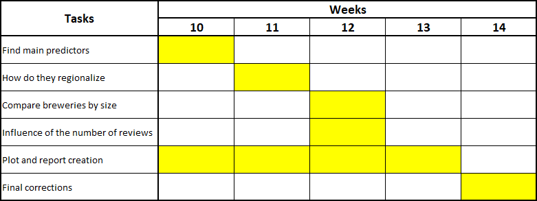

# ADA_Project

## Decoding Regional Preferences and Ratings 

## Abstract
This research project aims to uncover the underlying factors that influence beer ratings and determine how these factors vary across different regions. The motivation behind the study includes but is not limited to understanding whether smaller breweries with limited beer selections are favored over larger ones on a global scale, how regional predictors affect beer ratings, and the pattern of the user factor’s influence on rating . We seek to tell the story of regional beer appreciation, exploring the degree of localized preferences’  impact on a beer’s success and reputation. By analyzing beer ratings and reviews, this project will identify key predictors of beer popularity, investigate regional variations in these predictors, and examine the correlation between the number of reviews and beer ratings. A critical component of the study is to establish a methodology for sourcing representative and reliable data from users to ensure the validity of our findings. The outcomes of this research will provide valuable insights for breweries to tailor their products to regional tastes and for enthusiasts to understand global beer trends.

## Research questions:
- What are the main predictors of a beer’s rating ?
- How do those predictors regionalize ?
- Do breweries with smaller beer selection cater more than bigger breweries to their market ? 
- Is the rating influenced by the number of reviews?

## Methods
### 1) Data Sampling
Although we have got the original data, due to the tremendous size of the dataset, applying a stratified sampling method is necessary to balance representation across different beer types, brewery sizes, regions and practicability.
%more details on assembly of the data set (merge, removal, etc)
%we worked on a sampled version, will switch later
### 2) Data Analysis
Perform exploratory data analysis to understand distributions, detect outliers, and prepare the dataset for further analysis.
Utilize quantitative methods such as regression analysis to identify the predictors of beer ratings. 
Apply multivariate analysis to understand the relationships between variables. Using Linear Regression, we also keep in mind the correlation doesn’t mean causality in our analysis (for exemple we cannot say that making a beer bitter makes it better but we can say that bitter beer has higher ratings in a specific country if the data says so).
We might employ natural language processing techniques to analyze textual reviews for sentiment and thematic content, contributing to the understanding of ratings.
Perform further, more in depth, analysis following the results of the exploratory analysis. Find the answers to our Research Questions.
Explore different methods to confirm, or not, or preliminary findings about the main predictors.
After the overall analysis we will explore how they breakdown by region
According to those results we will explore if the breweries cater to those regional characteristics
### 3) Data Representation
After extracting our results we need to communicate them
- location representations
- predictors representations
- other ...

## Proposed timeline

## Specialization of each team-member
- Anthony will focus on : Data sampling, Data presentation, Linear Regression
- Benjamin will explore the sentiment analysis
- Mathieu will focus on focusing
- Swann will focus on the final plotting of results and the implementation of different linear regression methods
- Xingchen will focus the construction of the website and the interactive chart embedding in it.

## (questions to TA)
Linear regression doesn’t give causality, but our observed variates are a consequence of the brewing process. There therefore is a causal relation between our observed covariates and the brewing process (for chemical and biological reasons). Is this supposition valid in our situation ?
To avoid problems that may arise from unobserved covariates we are thinking to find a way to do a sensitivity analysis but we don’t see a way to do it without testing for a treatment (like in slide 46 of [Course 6](https://docs.google.com/presentation/d/1dAAAGZLETByUCAQcPSgntHWp8lwLdjJKzgcHPGrhs8Q/edit#slide=id.gf762380974_6_404), which is not what we are trying to achieve.
